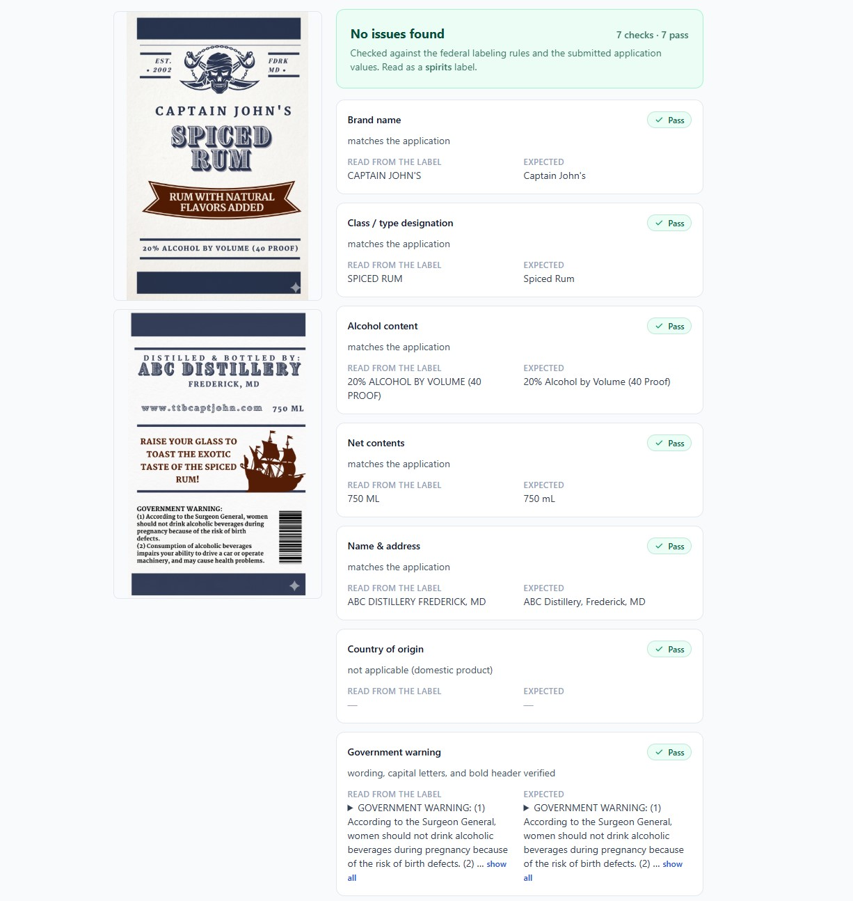
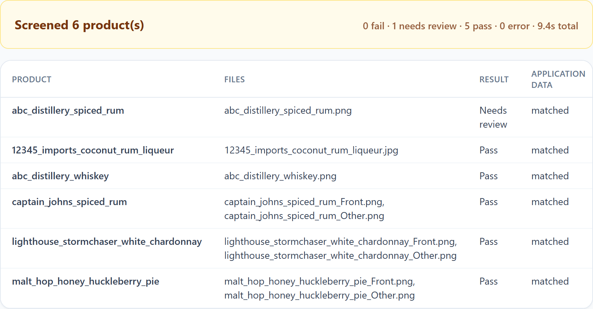

# TTB Label Verifier

[](https://github.com/abelma2/ttb-label-verifier-app/actions/workflows/ci.yml)

Verifies a U.S. alcohol beverage label (beer, wine, or distilled spirits) against the
applicant's submitted values and the federal labeling rules (TTB / 27 CFR). Every field
comes back **pass**, **needs review**, or **fail** with a reason, and the uploaded label
is shown beside the verdicts (click to zoom) so each read can be confirmed against the
image.

Two modes:

- **Single label** — upload the label image(s), front and back together, optionally add
  the application's values (typed in, or loaded from a spreadsheet), and verify.
- **Batch** (the "Multiple labels" tab) — drop many label photos at once. Files pair
  into products by filename (`oldtom_front.jpg` + `oldtom_back.jpg` become one product;
  a single stitched image works the same), an optional Excel application workbook
  matches a row of expected values to each product, and results land in a worst-first
  table with per-product detail. A ready-to-fill template with instructions is
  downloadable in the app.

**Live demo:** <https://austin-belman-ttb-label-verifier-app.vercel.app> — or run it
locally in three commands ([Quick start](#quick-start)) and try the bundled
[example labels](examples/README.md). Under the hood: a Next.js (App Router) frontend +
a thin FastAPI serverless function over a shared Python engine, deployed as one Vercel
project.

**Design rationale:** [APPROACH.md](APPROACH.md) — the approach, tools used, and
assumptions made, in three pages.


*Single label: the demo spiced rum read from a front + back pair and matched against its
application values — 7 checks, 7 pass.*


*Batch: the six demo products screened in parallel; the worst results sort to the top.*

## Quick start

Prerequisites: **Python ≥ 3.10** (the engine uses modern type syntax), **Node ≥ 22.6**
(`npm run test:web` uses Node's built-in TypeScript stripping), and an OpenAI **API
platform** key (see [Environment variables](#environment-variables)).

```bash
cp .env.example .env     # then paste your OpenAI key into OPENAI_API_KEY
npm run setup            # = pip install -r requirements-dev.txt && npm install
npm run dev:all          # API on :8000 + frontend on :3000, in one terminal
```

Open http://localhost:3000 — [examples/README.md](examples/README.md) is a one-minute
walkthrough with the bundled demo labels. Interactive API docs:
http://localhost:8000/api/py/docs.

> `npm install` resolves the `xlsx` dependency from the SheetJS CDN tarball (the npm
> registry's version is frozen at 0.18.5 with known vulnerabilities), so installs need
> `cdn.sheetjs.com` reachable.

### Manual (two terminals)

To run the servers separately:

```bash
pip install -r requirements-dev.txt
npm install
cp .env.example .env             # dev:api won't start without this file (uvicorn --env-file)

# terminal 1 — API on :8000
export OPENAI_API_KEY="sk-..."   # PowerShell: $env:OPENAI_API_KEY = "sk-..."
npm run dev:api                  # = uvicorn api.index:app --reload --port 8000 --env-file .env

# terminal 2 — frontend on :3000 (proxies /api/py/* to :8000)
npm run dev
```

An `OPENAI_API_KEY` set in the environment takes precedence over the value in `.env`.

### Tests

All tests are pure and run offline — the model call is mocked in the API tests.

```bash
pytest                       # engine tests + API-layer tests
npm run test:api             # just the API layer
npm run test:web             # batch grouping / application-file parsing (node:test)
npm run build                # production Next.js build — also the TypeScript type gate
```

`test:web` lists its test files explicitly in `package.json` — a new
`src/lib/__tests__/*.test.mts` file must be added there or it will silently never run.
There is no separate lint/typecheck script; `npm run build` (or `npx tsc --noEmit`) is
the type gate.

## Architecture

```
Browser (Next.js, TypeScript + Tailwind)
   │  POST /api/py/verify  (multipart: 1–4 images + optional application JSON)
   ▼
FastAPI function (api/index.py — validation, orchestration, error mapping ONLY)
   │
   ├─► extraction.py    the vision model READS the label (never sees expected values)
   └─► verification.py  deterministic Python JUDGES (rules + application match)
            ▲
        config.py        regulatory constants & thresholds
```

Two stages — **the model reads, deterministic Python judges** — and the web layer adds
no third stage: `api/index.py` contains zero business logic. The engine modules at the
repo root are untouched and shared by the web API and the unit tests.

The frontend always calls relative `/api/py/*` — proxied to uvicorn on `:8000` in dev,
rewritten to the `api/index.py` function in production (`next.config.ts`). Browser and
API are same-origin in both cases, so there is **no CORS surface at all** — by design,
not by `allow_origins=["*"]`.

## The engine: how verification works

1. **Extraction** (`extraction.py`) — the vision model reads the image(s) — front +
   back together as one label — and returns a fixed JSON schema. Each field is
   `{present, value, confidence}`, distinguishing "absent from the label" from "present
   but unreadable". The model only transcribes what it sees; it never judges compliance
   and never sees the expected values.
2. **Verification** (`verification.py`) — deterministic comparison per field:
   - **Brand & class/type** — fuzzy match against the union of the application's
     brand/fanciful-name and class/composition values, with a near-miss typo guard
     (a 1–2 character difference routes to review rather than auto-passing).
   - **Alcohol content** — class-dependent presence (required for spirits, conditional
     for wine, optional for beer), plus two label-only checks: a bare "ABV" notation
     fails (not a TTB form), and a proof inconsistent with the stated ABV fails.
   - **Net contents** — compared by parsed volume, not just the printed string: the
     same volume in a different unit or format routes to review; a materially
     different volume fails.
   - **Name & address, country of origin** — forgiving subset matching for the U.S.
     responsible party (on imports, the importer; other producer/bottler statements
     surface as evidence).
   - **Government warning** — the fail-closed gate described under
     [Regulatory grounding](#regulatory-grounding).
   - **Wine appellation** — conditionally mandatory; also detailed below.

   Overall = worst field status, and a low-confidence read escalates a pass to needs
   review.

### Regulatory grounding

Rules are grounded in the three TTB Beverage Alcohol Manuals (cited in `config.py`) and
TTB's "Checklist of Mandatory Label Information" per class:

- **Government warning** (27 CFR part 16) — exact wording; "GOVERNMENT WARNING" in caps
  **and bold**; "S"/"G" in Surgeon General capitalized. The warning is read by a
  **dedicated second model** (`WARNING_SUPPLEMENT_MODEL`) in parallel with the main
  extraction — on ground truth it scored 100% on the full warning verdict (60/60) versus
  70% for the main read, and it transcribes what is printed rather than reciting the
  federal text. Wording and caps are judged deterministically from that transcription;
  bold at worst routes to **needs review** (confirm against the label image beside the
  verdicts) — it can never fail a label. When only one of the two readers finds a
  warning at all, absence is a review, never a one-reader fail.
- **Alcohol content** — class-dependent presence; bare "ABV" notation fails (not a TTB
  form); a proof inconsistent with the stated ABV fails.
- **Wine appellation** — conditionally mandatory when the label shows a varietal,
  vintage, semi-generic designation, or estate claim (27 CFR 4.25/4.34); a U.S. origin
  (state, county, AVA) or a foreign region (e.g. "CHAMPAGNE" near the brand) both
  satisfy it.

Conditional disclosures whose triggers aren't visible get no automated pass/fail: the
sulfite declaration is extracted into its own evidence-only field; the rest (FD&C
Yellow #5, aspartame, age statements, …) are transcribed verbatim into
`additional_statements` for the reviewer.

## Repository layout

```
api/                  FastAPI serverless function (index.py) + Pydantic models (_models.py)
src/                  Next.js app: app/ (pages), components/, lib/ (types, api client,
                      batch orchestration, stem grouping, Excel parsing, image prep)
config.py             regulatory constants & tunable thresholds (some env-overridable)
extraction.py         vision extraction -> fixed JSON schema
verification.py       deterministic verification -> pass/needs_review/fail per field
tests/                test_verification.py (engine) + test_api.py (API glue; mocks the model)
examples/             demo labels + a filled-in application spreadsheet + walkthrough
                      README (batch mode matches the spreadsheet; single mode is typed)
next.config.ts        dev proxy / prod rewrite for /api/py/*
requirements.txt      lean deploy manifest (requirements-dev.txt adds uvicorn, pytest, …)
vercel.json           Python function config (maxDuration)
.vercelignore         keeps all dev/test/tooling content out of deployments
```

## Environment variables

| Variable | Required | Purpose |
| --- | --- | --- |
| `OPENAI_API_KEY` | yes | OpenAI **API platform** key (platform.openai.com, billing enabled — not a ChatGPT subscription) |
| `EXTRACTION_MODEL` | no | override the vision model (default `gpt-5.4-mini`, chosen by a 5× stability benchmark) |
| `WARNING_SUPPLEMENT_MODEL` | no | model for the dedicated parallel second read of the government warning (default `gpt-4.1`; set empty to disable — see [Regulatory grounding](#regulatory-grounding)) |
| `WARNING_BOLD_POLICY` | no | how the warning's bold observation is judged (default `supplement_gate`: bold → pass, not bold or unreadable → needs review, never fail; other modes in `config.py`) |
| `RATE_LIMIT_MAX_RETRIES` | no | bounded backoff retries for OpenAI rate-limit (429) responses when a batch bursts concurrent calls (default `2`; out-of-credit `insufficient_quota` errors are never retried) |

The FastAPI layer reads the key from the environment only (`os.environ`). Locally, copy
`.env.example` to `.env` (gitignored) and the dev servers load it for you; on Vercel, set
the key in the project's environment variables. Never commit secrets.

## Deploying to Vercel

1. Push the repo to GitHub and **Import** it in Vercel (framework auto-detects Next.js),
   or run `npx vercel` from the repo root.
2. Set the `OPENAI_API_KEY` environment variable in the Vercel project settings.
3. Deploy. `vercel.json` configures the Python function (`maxDuration: 60` — a 2-image
   read takes ~7–10 s and the engine's own request ceiling is 30 s), and `.vercelignore`
   keeps tests, the `examples/` demo assets, and any local dev content out of the
   deployment entirely (the Python builder bundles everything it doesn't exclude).

Notes: request bodies are capped at 4.5 MB by the platform — the frontend downscales
large images before upload (≤2048 px JPEG, lossless for the model's pipeline;
`src/lib/image.ts`) and the API still enforces hard limits (4 images, 4 MB/file, 4.3 MB
total) with clear JSON errors. The Python runtime on Vercel is currently 3.12.

## Assumptions & limitations

- Expected values are supplied by the reviewer (production would integrate COLA).
- Standard-of-fill container sizes, type-size/legibility rules, and "same field of
  vision" layout rules are out of scope (layout/geometry isn't reliably verifiable from
  one photo).
- The vision model isn't perfectly deterministic; the checks absorb this — near misses
  go to review, never silent passes.
- This calls an external vision API; a production deployment inside TTB's network would
  need an on-prem or allowlisted model.

A screening aid — not a final legal determination.

## License

[MIT](LICENSE). A personal demo project — not affiliated with the U.S. Alcohol and
Tobacco Tax and Trade Bureau (TTB). Issues and suggestions welcome.
